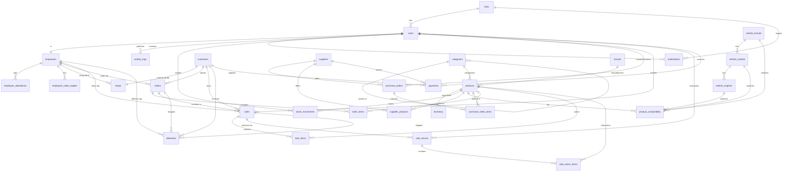
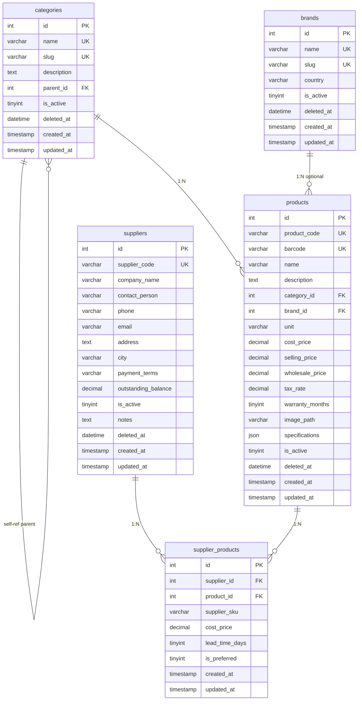
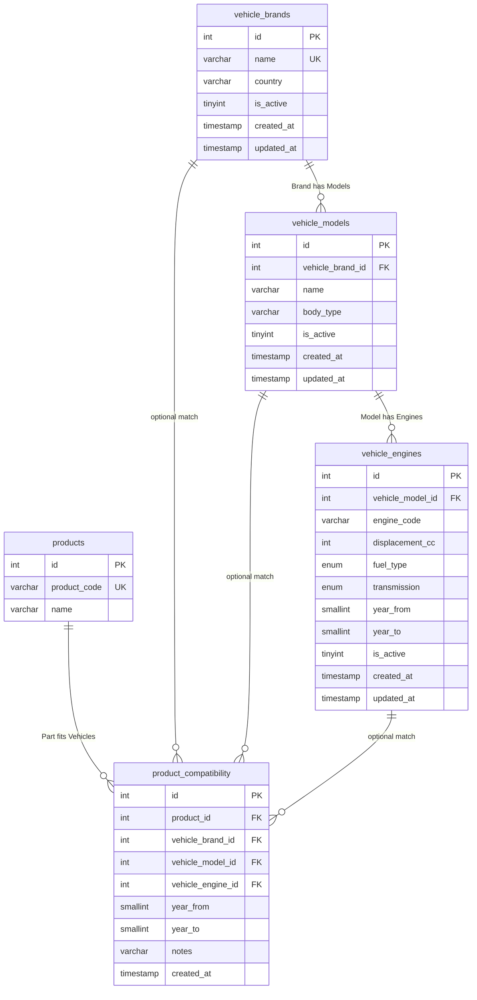
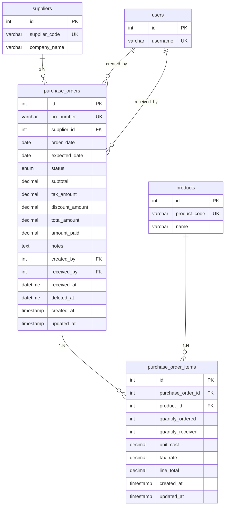
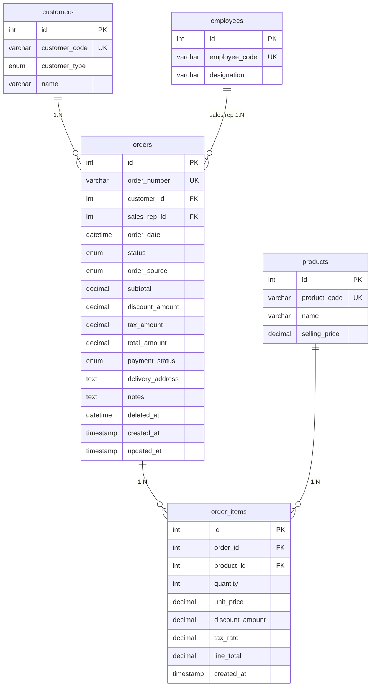
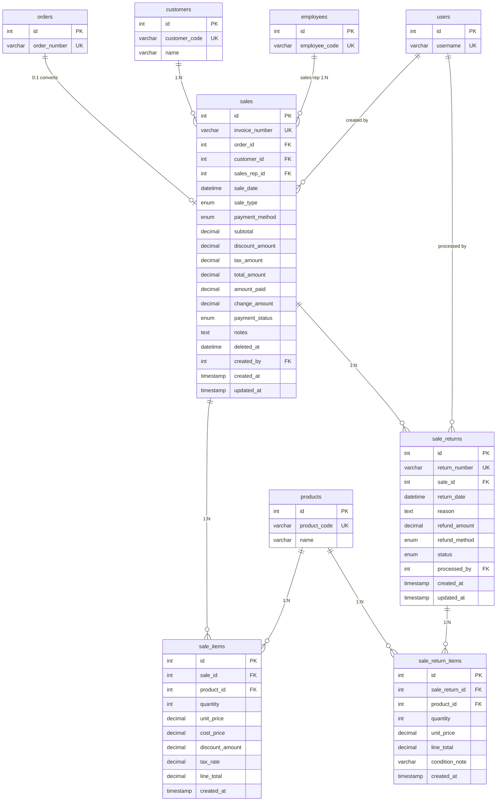
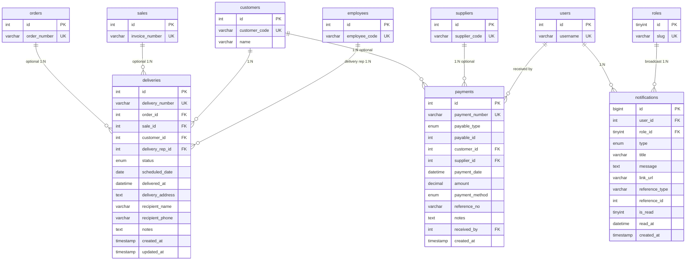
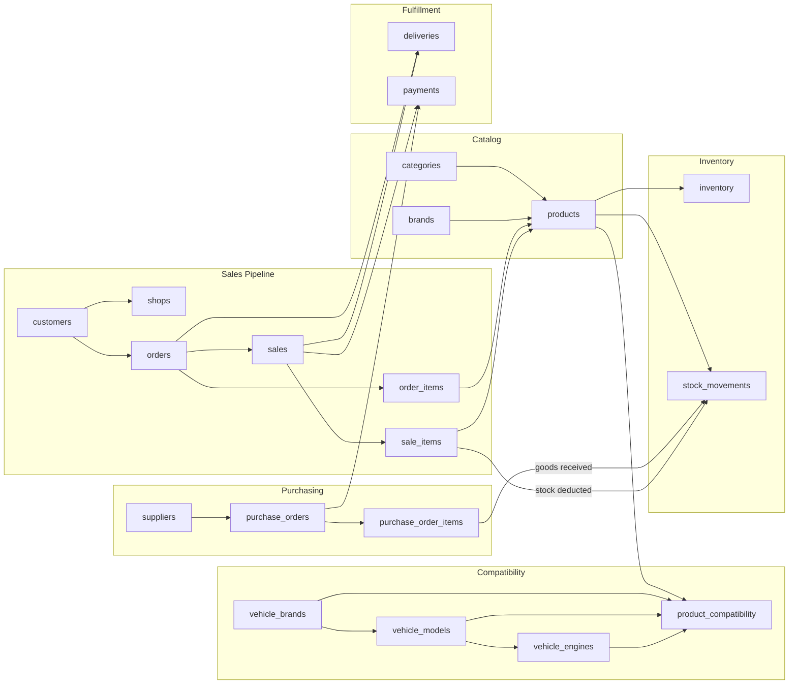

# SmartAuto ERP — Full Entity-Relationship Diagram

Database: `smartauto_erp` · 31 tables · 5 views · MySQL 8+

---

## Legend

| Symbol | Meaning |
|--------|---------|
| **PK** | Primary Key |
| **FK** | Foreign Key |
| **UK** | Unique Key |
| `||--||` | One-to-One |
| `||--o{` | One-to-Many |
| `}o--o{` | Many-to-Many (via junction table) |

---

## Master Relationship Overview

High-level map of all 31 tables and foreign-key relationships.



---

## Module 1 — Authentication & User Management

```mermaid
erDiagram
    roles {
        tinyint id PK
        varchar name UK
        varchar slug UK
        varchar description
        json permissions
        timestamp created_at
        timestamp updated_at
    }

    users {
        int id PK
        tinyint role_id FK
        varchar username UK
        varchar email UK
        varchar password_hash
        varchar full_name
        varchar phone
        varchar avatar
        tinyint is_active
        datetime last_login_at
        datetime password_changed_at
        datetime deleted_at
        timestamp created_at
        timestamp updated_at
    }

    employees {
        int id PK
        int user_id FK_UK
        varchar employee_code UK
        varchar designation
        enum department
        date hire_date
        decimal base_salary
        decimal commission_rate
        text address
        varchar emergency_contact
        varchar emergency_phone
        datetime deleted_at
        timestamp created_at
        timestamp updated_at
    }

    employee_attendance {
        int id PK
        int employee_id FK
        date attend_date
        time check_in
        time check_out
        enum status
        varchar notes
        timestamp created_at
        timestamp updated_at
    }

    employee_sales_targets {
        int id PK
        int employee_id FK
        tinyint target_month
        smallint target_year
        decimal target_amount
        decimal achieved_amount
        timestamp created_at
        timestamp updated_at
    }

    activity_logs {
        bigint id PK
        int user_id FK
        varchar action
        varchar module
        varchar record_type
        int record_id
        text description
        varchar ip_address
        varchar user_agent
        timestamp created_at
    }

    settings {
        int id PK
        varchar setting_key UK
        text setting_value
        varchar setting_group
        varchar description
        timestamp updated_at
    }

    sequences {
        int id PK
        varchar seq_type UK
        varchar prefix
        int current_value
        tinyint pad_length
        timestamp updated_at
    }

    roles ||--o{ users : "1:N"
    users ||--|| employees : "1:1"
    employees ||--o{ employee_attendance : "1:N"
    employees ||--o{ employee_sales_targets : "1:N"
    users ||--o{ activity_logs : "1:N"
```

---

## Module 2 — Customers & Shops

```mermaid
erDiagram
    customers {
        int id PK
        varchar customer_code UK
        enum customer_type
        varchar name
        varchar contact_person
        varchar phone
        varchar email
        text address
        varchar city
        text notes
        tinyint is_active
        datetime deleted_at
        timestamp created_at
        timestamp updated_at
    }

    shops {
        int id PK
        int customer_id FK_UK
        varchar shop_name
        varchar registration_no
        decimal credit_limit
        decimal credit_balance
        tinyint payment_terms_days
        int assigned_rep_id FK
        varchar tax_number
        datetime deleted_at
        timestamp created_at
        timestamp updated_at
    }

    employees {
        int id PK
        int user_id FK
        varchar employee_code UK
        varchar designation
    }

    customers ||--|| shops : "1:1 B2B extension"
    employees ||--o{ shops : "assigned rep 1:N"
```

---

## Module 3 — Product Catalog & Suppliers



---

## Module 4 — Vehicle Compatibility



**Compatibility hierarchy:** Brand → Model → Engine → Year range

---

## Module 5 — Inventory Management

```mermaid
erDiagram
    products {
        int id PK
        varchar product_code UK
        varchar name
        decimal cost_price
        decimal selling_price
    }

    inventory {
        int id PK
        int product_id FK_UK
        int quantity_on_hand
        int quantity_reserved
        int quantity_damaged
        int reorder_level
        int reorder_quantity
        datetime last_stock_in_at
        datetime last_stock_out_at
        timestamp updated_at
    }

    stock_movements {
        bigint id PK
        int product_id FK
        enum movement_type
        int quantity
        int quantity_before
        int quantity_after
        decimal unit_cost
        varchar reference_type
        int reference_id
        varchar notes
        int created_by FK
        timestamp created_at
    }

    users {
        int id PK
        varchar username UK
    }

    products ||--|| inventory : "1:1 stock record"
    products ||--o{ stock_movements : "1:N history"
    users ||--o{ stock_movements : "created by"
```

**Movement types:** `purchase_in`, `sale_out`, `adjustment_in`, `adjustment_out`, `transfer_in`, `transfer_out`, `return_in`, `return_out`, `damaged`

---

## Module 6 — Purchase Management



**PO status flow:** `draft` → `pending` → `partial` → `received` | `cancelled`

---

## Module 7 — Order Management



**Order sources:** `pos`, `shop_portal`, `rep_field`, `phone`, `walk_in`

---

## Module 8 — Sales, Returns & Invoicing



---

## Module 9 — Delivery, Payments & Notifications



**Payments polymorphic reference:** `payable_type` + `payable_id` → `sale`, `purchase_order`, `customer_credit`, `supplier`

---

## Complete Business Workflow Diagram

End-to-end operational flow across modules.



---

## Relationship Summary Table

| Parent Entity | Child Entity | Cardinality | FK Column |
|---------------|--------------|-------------|-----------|
| roles | users | 1:N | users.role_id |
| users | employees | 1:1 | employees.user_id |
| employees | employee_attendance | 1:N | employee_attendance.employee_id |
| employees | employee_sales_targets | 1:N | employee_sales_targets.employee_id |
| users | activity_logs | 1:N | activity_logs.user_id |
| customers | shops | 1:1 | shops.customer_id |
| employees | shops | 1:N | shops.assigned_rep_id |
| categories | categories | 1:N | categories.parent_id |
| categories | products | 1:N | products.category_id |
| brands | products | 1:N | products.brand_id |
| suppliers | supplier_products | 1:N | supplier_products.supplier_id |
| products | supplier_products | 1:N | supplier_products.product_id |
| vehicle_brands | vehicle_models | 1:N | vehicle_models.vehicle_brand_id |
| vehicle_models | vehicle_engines | 1:N | vehicle_engines.vehicle_model_id |
| products | product_compatibility | 1:N | product_compatibility.product_id |
| vehicle_brands | product_compatibility | 1:N | product_compatibility.vehicle_brand_id |
| vehicle_models | product_compatibility | 1:N | product_compatibility.vehicle_model_id |
| vehicle_engines | product_compatibility | 1:N | product_compatibility.vehicle_engine_id |
| products | inventory | 1:1 | inventory.product_id |
| products | stock_movements | 1:N | stock_movements.product_id |
| users | stock_movements | 1:N | stock_movements.created_by |
| suppliers | purchase_orders | 1:N | purchase_orders.supplier_id |
| purchase_orders | purchase_order_items | 1:N | purchase_order_items.purchase_order_id |
| products | purchase_order_items | 1:N | purchase_order_items.product_id |
| customers | orders | 1:N | orders.customer_id |
| employees | orders | 1:N | orders.sales_rep_id |
| orders | order_items | 1:N | order_items.order_id |
| products | order_items | 1:N | order_items.product_id |
| orders | sales | 1:0..1 | sales.order_id |
| customers | sales | 1:N | sales.customer_id |
| employees | sales | 1:N | sales.sales_rep_id |
| sales | sale_items | 1:N | sale_items.sale_id |
| products | sale_items | 1:N | sale_items.product_id |
| sales | sale_returns | 1:N | sale_returns.sale_id |
| sale_returns | sale_return_items | 1:N | sale_return_items.sale_return_id |
| orders | deliveries | 1:N | deliveries.order_id |
| sales | deliveries | 1:N | deliveries.sale_id |
| customers | deliveries | 1:N | deliveries.customer_id |
| employees | deliveries | 1:N | deliveries.delivery_rep_id |
| customers | payments | 1:N | payments.customer_id |
| suppliers | payments | 1:N | payments.supplier_id |
| users | notifications | 1:N | notifications.user_id |
| roles | notifications | 1:N | notifications.role_id |

**Standalone tables (no FKs):** `settings`, `sequences`

---

## Database Views (Read-Only)

| View | Purpose | Key Joins |
|------|---------|-----------|
| v_low_stock_products | Low-stock alerts | inventory → products → categories |
| v_product_stock | Stock valuation | products → inventory → categories → brands |
| v_daily_sales_summary | Daily revenue | sales (aggregated) |
| v_employee_sales_performance | Rep KPIs | employees → users → sales |
| v_vehicle_parts_finder | Public parts search | product_compatibility → products → vehicles → inventory |

---

## Entity Count by Domain

| Domain | Tables |
|--------|--------|
| Auth & Users | 7 (roles, users, employees, attendance, targets, activity_logs, + settings, sequences) |
| Customers | 2 (customers, shops) |
| Catalog | 5 (categories, brands, products, suppliers, supplier_products) |
| Vehicle | 4 (vehicle_brands, models, engines, product_compatibility) |
| Inventory | 2 (inventory, stock_movements) |
| Purchasing | 2 (purchase_orders, purchase_order_items) |
| Orders | 2 (orders, order_items) |
| Sales | 4 (sales, sale_items, sale_returns, sale_return_items) |
| Fulfillment | 3 (deliveries, payments, notifications) |
| **Total** | **31 tables + 5 views** |

---

*Generated from `database/schema.sql` — SmartAuto ERP*
